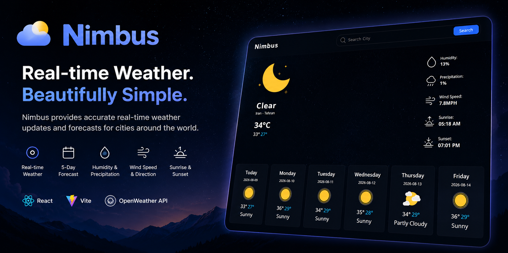
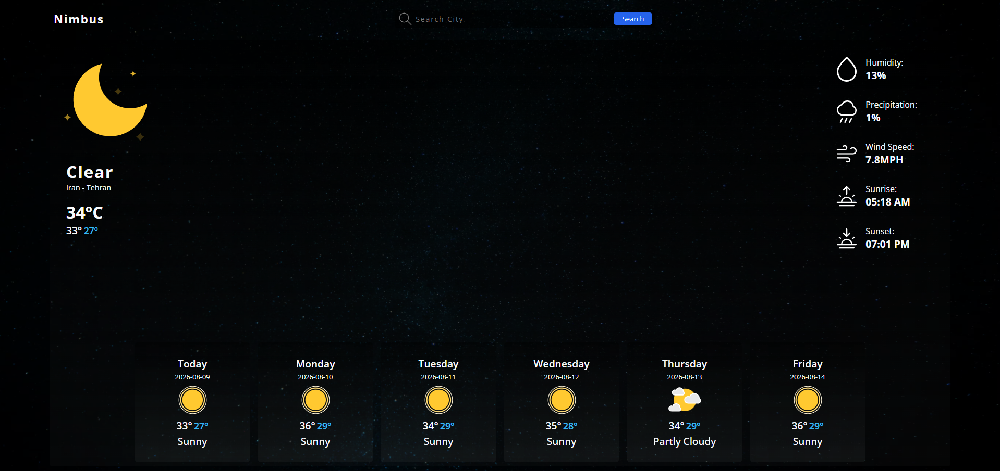
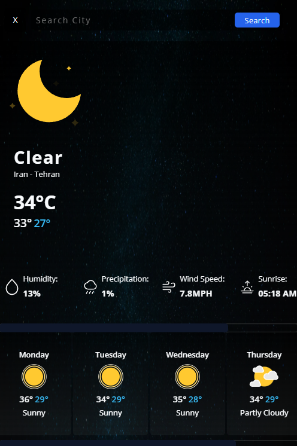

<div align="center">



<br />

# 🌤️ Nimbus

### Real-time weather. Beautifully simple.

A modern and responsive weather application built with React that provides
real-time weather information and multi-day forecasts for cities around the world.

<br />

[](https://nimbus-green.vercel.app/)
[](https://github.com/Hassan-src/Nimbus)

</div>

---

## ✨ Overview

**Nimbus** is a React-based weather application designed to provide users
with a clean and intuitive way to explore current weather conditions and
short-term forecasts.

The application allows users to search for cities and view information such as:

- Current temperature
- Weather conditions
- High and low temperatures
- Humidity
- Precipitation probability
- Wind speed
- Sunrise
- Sunset
- Multi-day weather forecasts

The project focuses on building a polished frontend experience while
practicing real-world API integration, asynchronous data fetching,
React state management, reusable components, custom hooks, and responsive design.

---

## 🚀 Features

### 🌎 Weather Search

- Search weather information by city
- Dynamic weather updates
- Search input with user-friendly interaction

### 🌡️ Current Weather

Displays important current weather information:

- Current temperature
- Weather condition
- Daily high and low
- Humidity
- Precipitation
- Wind speed
- Sunrise
- Sunset

### 📅 Forecast

View upcoming weather conditions through a multi-day forecast including:

- Day
- Date
- Weather condition
- Weather icon
- High temperature
- Low temperature

### 🎨 User Interface

- Dark atmospheric weather-themed interface
- Responsive layout
- Custom weather icons
- Clean visual hierarchy
- Interactive search experience
- Loading states
- Error handling

### ⚛️ React Architecture

The application uses reusable React components and separates responsibilities
between:

- UI components
- Custom hooks
- Context
- API services
- Application state

---

## 🛠️ Tech Stack

<div align="center">

### Frontend


### Tooling


</div>

### Technologies

| Technology      | Purpose                                   |
| --------------- | ----------------------------------------- |
| ⚛️ React        | UI development and component architecture |
| 🟨 JavaScript   | Application logic                         |
| 🌐 HTML5        | Semantic structure                        |
| 🎨 CSS3         | Styling and responsive layouts            |
| ⚡ Vite         | Development server and production build   |
| 🔍 ESLint       | Code quality and linting                  |
| 🐙 Git & GitHub | Version control                           |

---

## 🧠 React Concepts Demonstrated

Nimbus was built to practice several important React concepts.

### Components

The interface is divided into reusable components rather than being implemented
as one large component.

### `useState`

Used to manage interactive application state such as the selected city,
weather information, loading states, and errors.

### `useContext`

Application-level weather state is shared through React Context to avoid
unnecessary prop drilling.

### Custom Hooks

Weather-related logic is extracted into reusable hooks.

For example:

```text
useCityWeatherCurrent
useFutureForcast
```

---

## 🏗️ React Architecture

The application uses reusable React components and separates responsibilities
between:

- UI components
- Custom hooks
- Context
- API services
- Application state

This architecture keeps the application modular and makes individual parts
easier to maintain and extend.

---

## 🖼️ Preview

### Desktop



### Mobile



---

## 🌐 API Integration

Nimbus uses an external weather API to retrieve real-time weather information
and forecasts.

The API layer is isolated inside:

```text
src/services/api.js
```

The application then consumes that data through custom React Hooks.

```text
External Weather API
        ↓
src/services/api.js
        ↓
Custom React Hooks
        ↓
Context / Application State
        ↓
React Components
        ↓
User Interface
```

This architecture keeps API communication and data-fetching responsibilities
separate from UI components, making the application easier to maintain,
test, and extend.

---

## 📱 Responsive Design

Nimbus is designed to work across different screen sizes.

The interface adapts to:

- 🖥️ Desktop
- 💻 Laptop
- 📱 Mobile
- 📟 Tablet

Responsive design is implemented using CSS media queries, flexible layouts,
and responsive components.

---

## ⚡ Loading & Error States

Network requests can take time or fail, so Nimbus provides appropriate
application states.

### Loading

A dedicated loader is displayed while weather information is being retrieved.

```text
User searches for a city
        ↓
API request starts
        ↓
Loading state
        ↓
Weather data received
        ↓
Weather UI displayed
```

### Error

If the API request fails or the city cannot be found, the application provides
an appropriate error state instead of leaving the interface blank.

---

## ♿ Accessibility

Accessibility was considered throughout the interface.

The project aims to provide:

- Semantic HTML
- Accessible form controls
- Visible interactive states
- Keyboard-friendly interactions
- Appropriate text contrast
- Responsive layouts
- Clear error feedback
- Meaningful labels

---

## 📂 Project Structure

```text
Nimbus/
│
├── public/
│
├── src/
│   ├── components/
│   │   ├── Header/
│   │   │   ├── Header.jsx
│   │   │   ├── Logo.jsx
│   │   │   └── SearchBar.jsx
│   │   ├── Loader/
│   │   │   └── Loader.jsx
│   │   └── TodayDetails/
│   │       ├── ComingForecast.jsx
│   │       ├── DetailedInfo.jsx
│   │       ├── MainWeatherInfo.jsx
│   │       └──  TodayDetails.jsx
│   │
│   ├── context/
│   │   ├── MainProvider.jsx
│   │   └──  useWeatherPost.jsx
│   │
│   ├── hooks/
│   │   ├── useCityWeatherCurrent.jsx
│   │   └── useFutureForecast.jsx
│   │
│   ├── services/
│   │   └── api.js
│   │
│   ├── App.jsx
│   ├── App.css
│   ├── index.css
│   └── main.jsx
│
├── .env.example
├── .gitignore
├── eslint.config.js
├── index.html
├── package.json
├── vite.config.js
└── README.md
```

---

## 📦 Installation

### 1. Clone the repository

```bash
git clone https://github.com/Hassan-src/Nimbus.git
```

### 2. Navigate to the project

```bash
cd Nimbus
```

### 3. Install dependencies

```bash
npm install
```

### 4. Configure environment variables

Create a `.env` file:

```env
VITE_WEATHER_API_KEY=your_api_key_here
```

### 5. Start the development server

```bash
npm run dev
```

The application will then be available at the local development URL
provided by Vite.

---

## 🏭 Production Build

Create an optimized production build:

```bash
npm run build
```

Preview the production build locally:

```bash
npm run preview
```

Run ESLint:

```bash
npm run lint
```

---

## 🔮 Future Improvements

The current version focuses on the core weather experience.

Possible future improvements include:

- 📍 Automatic location detection
- ⭐ Favorite cities
- 🕐 Detailed hourly forecast
- 📅 Extended forecast
- 🌡️ Celsius / Fahrenheit switch
- 🌙 Dynamic day/night themes
- 🌦️ Weather-based animated backgrounds
- 📊 Weather charts
- 🗺️ Interactive weather map
- 🔔 Severe weather notifications
- 📱 PWA support
- 💾 Persist recent searches
- 🌐 Multiple language support
- ♿ Further accessibility improvements
- ⚡ Improved caching and performance
- 🌍 Geolocation-based weather

---

## 📚 What I Learned

Building Nimbus helped me strengthen my understanding of:

- ⚛️ React component architecture
- 🪝 Custom React Hooks
- 🧠 Context API
- 🔄 Asynchronous JavaScript
- 🌐 REST API integration
- 📡 Fetching external data
- ⏳ Loading and error states
- 🔄 Conditional rendering
- 📱 Responsive CSS
- 🧩 Component composition
- 🗂️ Project organization
- 🔐 Environment variables
- ⚡ Vite development workflow
- 🔍 ESLint and code quality
- 🎨 Modern UI development

---

## 🎯 Project Goals

Nimbus was created as a practical React project to move beyond simple
component exercises and work with a real external API.

The primary goals were to practice:

```text
React
  ↓
Component Architecture
  ↓
State Management
  ↓
Custom Hooks
  ↓
API Integration
  ↓
Async Data
  ↓
Loading & Error States
  ↓
Responsive UI
```

The project focuses on applying these concepts together to create a
complete, maintainable frontend application.

---

## 🚀 Deployment

Nimbus is deployed using Vercel.

### Live Application

https://nimbus-green.vercel.app/

### GitHub Repository

https://github.com/Hassan-src/Nimbus

---

## 🤝 Contributing

Contributions, suggestions, and improvements are welcome.

### Fork the repository

```bash
git clone https://github.com/Hassan-src/Nimbus.git
```

### Create a feature branch

```bash
git checkout -b feature/your-feature
```

### Commit your changes

```bash
git add .
git commit -m "Add your feature"
```

### Push your branch

```bash
git push origin feature/your-feature
```

Then open a Pull Request.

---

## 🐛 Issues & Suggestions

If you find a bug or have a suggestion for improving Nimbus,
feel free to open an issue on GitHub.

**GitHub Repository:**

https://github.com/Hassan-src/Nimbus

---

## 🌐 Links

### 🚀 Live Demo

https://nimbus-green.vercel.app/

### 💻 Source Code

https://github.com/Hassan-src/Nimbus

### 🐙 GitHub

https://github.com/Hassan-src

---

## 👨‍💻 Developer

### Hassan Esmaeilpour

Frontend Developer passionate about building clean, interactive,
responsive web applications with React.

---

## ⭐ Support

If you like this project, consider giving the repository a ⭐ on GitHub.

---

<div align="center">

### 🌦️ Nimbus

**Real-time weather. Beautifully simple.**

Built with ❤️ using React.
